# 远程调试APP内h5

APP业务中常常需要对线上h5页面排查定位问题
目前的痛点：
* chrome调试页面无法模拟真实app内环境
* 网页注入vconsole类插件，页面样式查看不方便、报错提示不清晰

如何在chrome里调试App内的网页呢？

整理了一些目前各端的情况和方式以供参考：

## Android远程调试
前置准备：
* Android手机
* App测试包
* USB数据线
* Chrome浏览器

### Step1: 开启Webview远程调试
需要打开app测试包内的webview远程调试开关

以赶集App为例：“我的Tab > 右上角设置 > 开发者选项 > WebView远程调试”
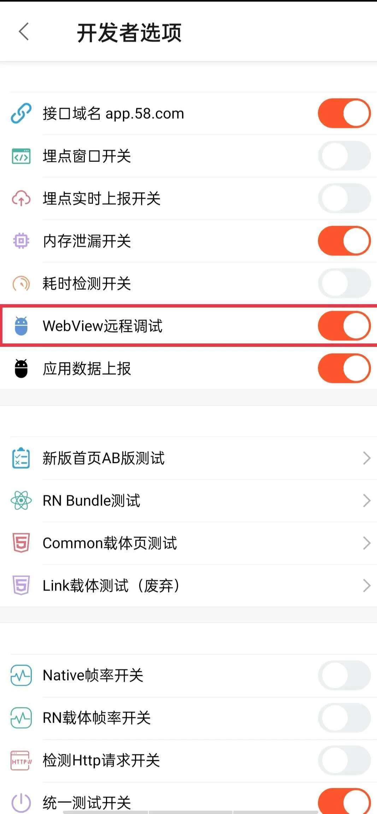

### Step2: 启用开发者模式
开发者模式的打开方法是，进入”设置 > 关于手机”菜单，找到”内部版本号”这一项（或类似名称的条目），在上面连续按七次。退回上一级菜单，应该就能看到”开发者模式”。

进入其中，打开”USB 调试”选项。
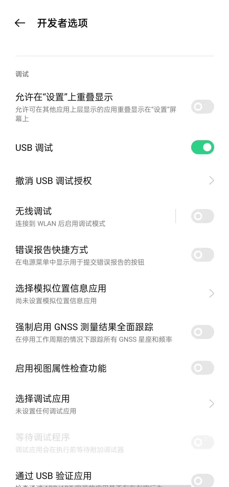

### Step3: 连接手机
1、使用 USB 线将手机和电脑连接起来。手机可能会有弹框，询问是否允许访问手机数据，选择”允许”。
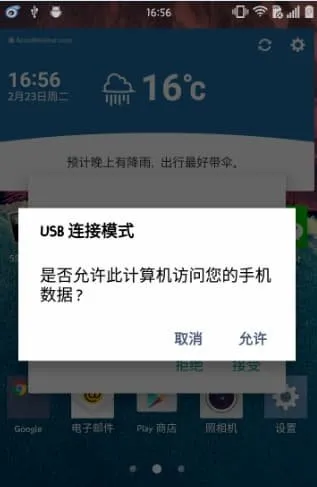

2、打开chrome浏览器，访问:**chrome://inspect/#devices**
选中 “Discover USB devices” 选项。

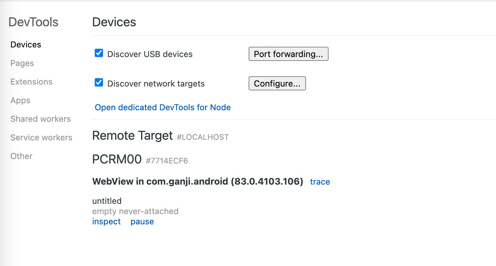

可以看到连接成功（如果没有显示，打开app内任意h5页面）
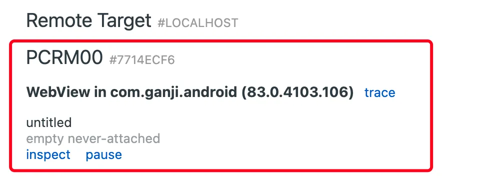

### Step4: 调试网页
1、打开app内h5页面
2、查看电脑chrome标签页(chrome://inspect/#devices)会新增一条页面信息
3、点击“inspect”按钮会弹窗独立调试窗口
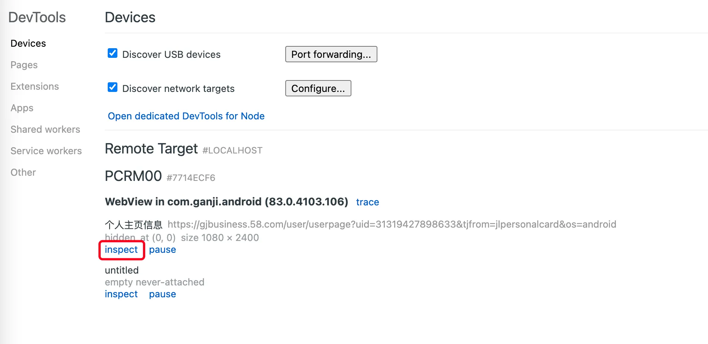
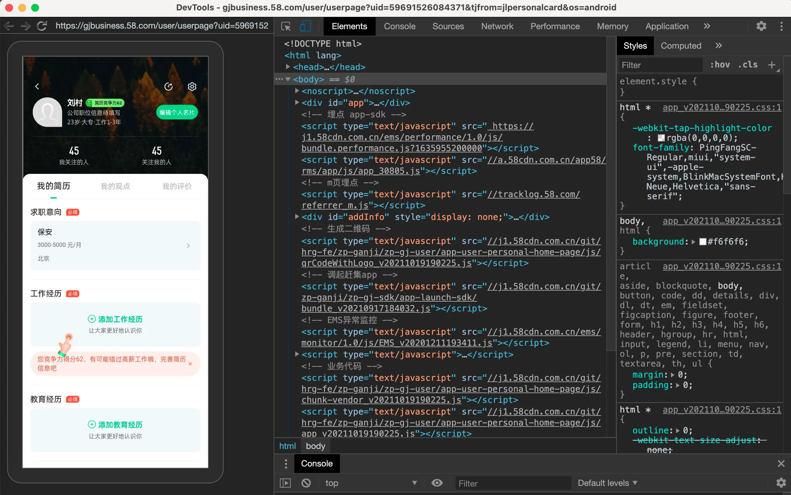

可以在独立的窗口调试页面

## IOS远程调试
前置准备：
* IOS手机
* APP开发版(通过USB方式安装)
* USB数据线
* Safari浏览器

### Step1: 启动iPhone中Safari调试模式
启用“Web 检查”功能，打开iPhone 依次进入“设置 > Safari浏览器 > 高级 > 网页检查器 > 启用”。
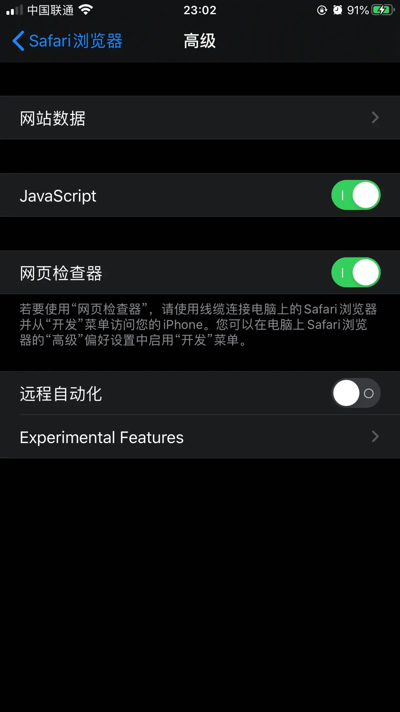

### Step2: 连接手机
使用 USB 将手机连接到电脑，如果弹出“是否信任此电脑”对话框，就选择“信任此电脑“

### Step3: Mac Safari调试
1、打开Mac Safari浏览器开发菜单
运行 Safari 浏览器，然后依次选取“Safari 浏览器 > 偏好设置”，点按“高级”面板，然后勾选“在菜单栏中显示开发菜单”。
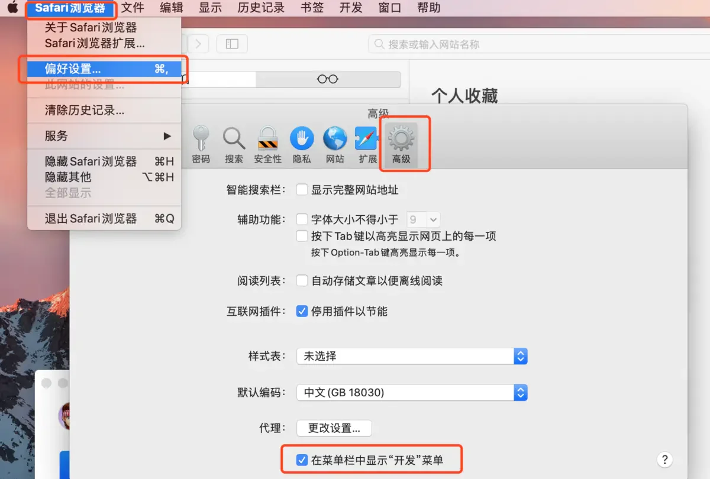
2、调试h5页面
先用app打开要调试的页面，打开Mac的Safari浏览器，在“开发”菜单中选择连接的手机
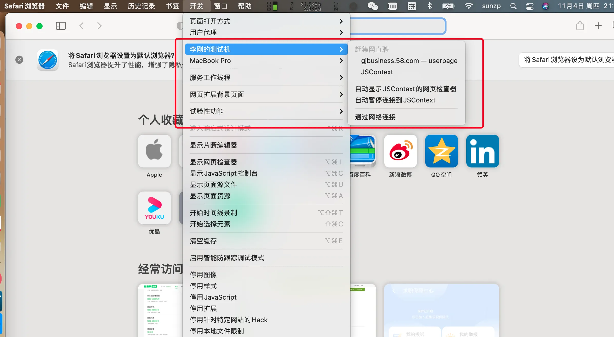
找到要调试的网页，点击弹出调试弹窗，可以开始调试页面了。
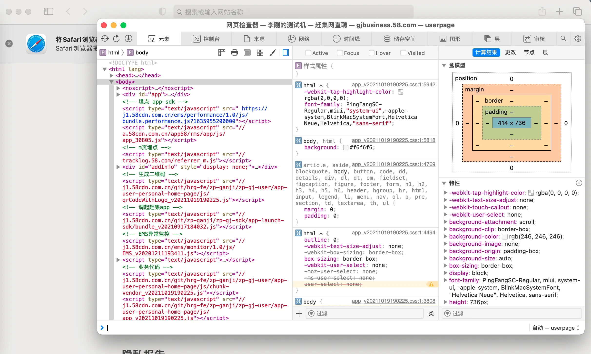

本文主要参考已有的远程调试方案进行汇总整理，解决无法真机调试的痛点，快速排查出问题。

参考：
* http://www.ruanyifeng.com/blog/2019/06/android-remote-debugging.html
* https://www.jianshu.com/p/86bb2b814461
